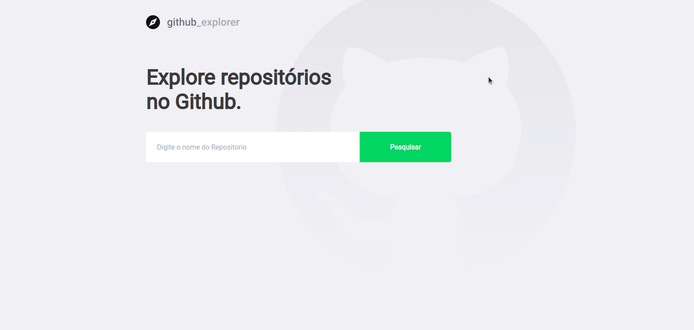

# Alfiado Constantino
<h1 align="center">
   
  Github Explorer
</h1>

Pesquisar <b>Repositorios</b> e listar as <b>Issues</b>

  

## Descrição
Neste projecto, desenvolvi uma aplicação para  consumer a API do Github pesquisando pelo repositório e depois listar as Issue do repositório.
 
Aprendendo fundamentos do reactjs usando typescript, styled-components para estios na nossa aplicação.

## Recursos Usados

- TypeScript
- Reactjs
- React-Router-Dom
- Axios

## Para rodar o projecto!
para rodar o projecto primeiro deve clonar o repositório e abrir a pasta no terminal e rodar os seguintes comandos: 
1. Clone o arquivo no seu terminal `https://github.com/alfiadoDev/desafio-fundamentos-reactjs.git`.
2. ainda no terminal digite o comando `cd desafio-fundamentos-reactjs` para entrar na pasta do projecto.
3. execute o comando `yarn` no terminal para instalar todas as dependências do projecto.
4. depois de terminar a instalação rodamos o comando `yarn start` para rodar o projecto no seu navegador.

## Rotas da Aplicação
- **GET /**: rota principal da aplicação para pesquisar um repositório. se existir a aplicação armazena o repositorio no **localStorage** e faz a listagem do mesmo.

**NOTA**: para ver detalhes ou issues do repositorio deves clicar em um dos repositorios na listagem.

## License

This project is licensed under the MIT License - see the [LICENSE](https://opensource.org/licenses/MIT) page for details.
